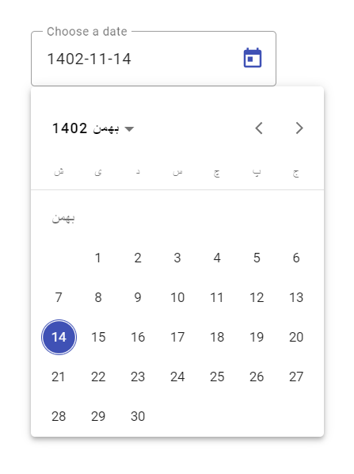

# MaterialPersianDateAdapter
# &#x202b; آداپتور هجری شمسی برای Angular Material DateAdapter
   

[![MIT License][license-image]][license-url] [![Build Status][travis-image]][travis-url] [![NPM version][npm-version-image]][npm-url] [![Codacy Badge][codacy-quality]][codacy-quality-url]

Set jalali (shamsi, persian, khorshidi) dates for Angular Material DatePicker.

<br/>

 

<br/>

Jalali calendar system borrowed from [Jalali Moment](https://github.com/fingerpich/jalali-moment) js library.

An npm package that contains jalali moment [DateAdapter](https://blog.angular.io/taking-advantage-of-the-angular-material-datepicker-237e80fa14b3) for angular material datepicker.

<br/>

## How to

### **Dependencies**  
```shell
ng add @angular/material
npm i jalali-moment -S
npm i @angular/material-moment-adapter

```
## Special Thanks
 https://github.com/peymanebrahimi/MaterialJalaliMomentAdapter
 


[npm-url]: https://npmjs.org/package/material-jalali-moment-adapter
[npm-version-image]: http://img.shields.io/npm/v/material-jalali-moment-adapter.svg?style=flat

[license-image]: http://img.shields.io/badge/license-MIT-blue.svg?style=flat
[license-url]: LICENSE

[travis-url]: https://travis-ci.org/peymanebrahimi/MaterialJalaliMomentAdapter
[travis-image]: https://travis-ci.org/peymanebrahimi/MaterialJalaliMomentAdapter.svg?branch=master


[codacy-quality]:https://api.codacy.com/project/badge/Grade/1b424dc44eb040d1a8c10fe9ba58016d
[codacy-quality-url]:https://www.codacy.com/manual/peymanebrahimi/MaterialJalaliMomentAdapter?utm_source=github.com&amp;utm_medium=referral&amp;utm_content=peymanebrahimi/MaterialJalaliMomentAdapter&amp;utm_campaign=Badge_Grade